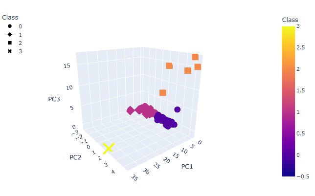
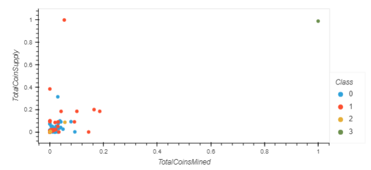
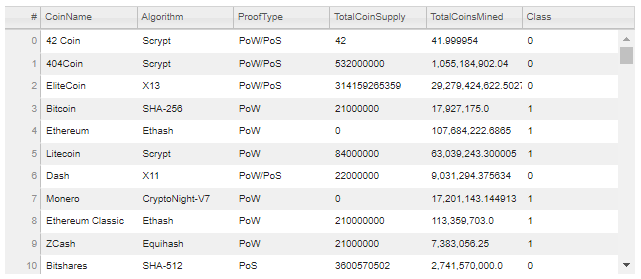

# Cryptocurrencies

## DISCLAIMER

This was an educational assignment only and is in no way an expression of the author's support or endorsement of any cryptocurrencies, Ponzi schemes, or other unregulated, fraud-ridden investment vehicles.

## Overview

In this challenge we used Pandas, Plotly, HvPlot, and SkLearn to use K-means to cluster a given set of cryptocurrency data.

## Methodology

We were given a csv file containing information about different cryptocurrencies.  After cleaning our data by removing rows with any null values and removing cryptocurrencies with zero mined coins, we scaled it and decided to use three principal components.  The resulting elbow curve suggested to use four clusters.  We then visualized our data in a Plotly 3D scatter plot of the principal components, an HvPlot table of information, and an HvPlot 2D scatter plot of TotalCoinsMined and TotalCoinsSupply scaled using SkLearn's MinMaxScaler.

## Images

3D Principal Components Scatter

2D Scaled Coin Data Scatter

Coin Information Table

